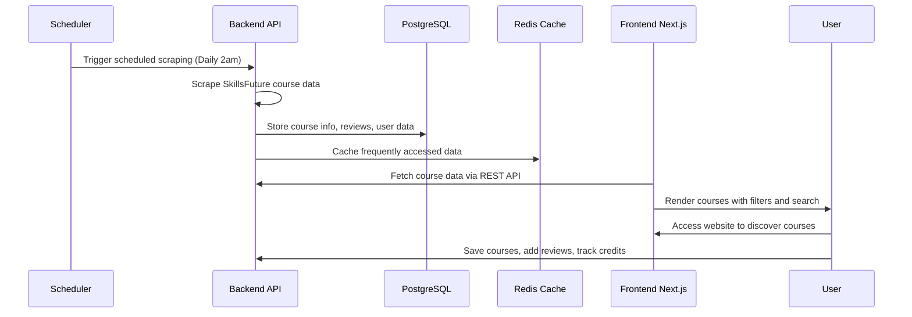
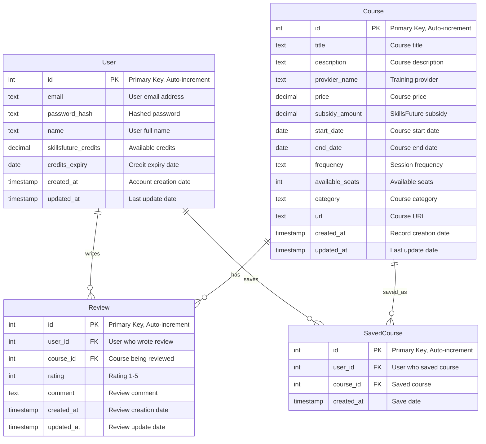

# `Skill Lobang`

Small, Full Stack [Web App](#architecture) for [SkillsFuture courses](#usage) in Singapore.

## Rationale

`Skill Lobang` is a comprehensive web application designed to help users in Singapore efficiently discover, compare, and optimize their SkillsFuture credit spending. The platform aggregates courses from multiple providers, offers intelligent filtering and sorting capabilities, and provides actionable insights to maximize the value of your SkillsFuture journey.

## Usage

> [!IMPORTANT]
> Read the [legal disclaimer](#legal-disclaimer) before using `Skill Lobang`.

Course data is refreshed daily at 2 AM SGT via automated scraping.

Use the live application [***here***](http://localhost:3000) once deployed.

## Stack

* *Frontend*: [React](https://react.dev/) via [Next.js](https://nextjs.org/)
    * *Framework*: [Next.js 14](https://nextjs.org/), [TypeScript](https://www.typescriptlang.org/)
    * *Styling*: [Tailwind CSS](https://tailwindcss.com/)
    * *UI Components*: [shadcn/ui](https://ui.shadcn.com/)
    * *State Management*: [React Context](https://react.dev/reference/react/useContext)
* *Backend*: [Node.js](https://nodejs.org/) via [Express](https://expressjs.com/)
    * *Runtime*: [Node.js](https://nodejs.org/), [TypeScript](https://www.typescriptlang.org/)
    * *Framework*: [Express.js](https://expressjs.com/)
    * *Authentication*: [JWT](https://jwt.io/), [bcrypt](https://www.npmjs.com/package/bcrypt)
    * *Validation*: [Joi](https://joi.dev/), [express-validator](https://express-validator.github.io/)
    * *Web Scraping*: [Puppeteer](https://pptr.dev/), [Cheerio](https://cheerio.js.org/)
* *Database*: [PostgreSQL](https://www.postgresql.org/) + [Redis](https://redis.io/)
    * *Primary Database*: [PostgreSQL](https://www.postgresql.org/)
    * *ORM*: [Prisma](https://www.prisma.io/) or [TypeORM](https://typeorm.io/)
    * *Caching*: [Redis](https://redis.io/)
    * *Connection Pooling*: [node-postgres](https://node-postgres.com/)
* *Deployment*: [Docker](https://www.docker.com/)
* *Scheduling*: [node-cron](https://www.npmjs.com/package/node-cron)
* *Testing*: [Jest](https://jestjs.io/), [React Testing Library](https://testing-library.com/docs/react-testing-library/intro/)
* *Linting*: [ESLint](https://eslint.org/), [Prettier](https://prettier.io/)

## Features

`Skill Lobang` supports comprehensive SkillsFuture course discovery with the following features:

| Feature | Implementation Status | Description |
| :--- | :--- | :--- |
| Course Aggregation | ✅ | Scrapes and aggregates courses from multiple providers |
| Smart Filtering | ✅ | Filter by price, subsidy, dates, availability, ratings |
| Credit Optimization | ✅ | Highlights courses optimal for expiring credits |
| Provider Reviews | ✅ | User ratings and reviews for training providers |
| Personal Dashboard | ✅ | Track saved courses and credit status |
| Alert System | ✅ | Notifications for credit expiry and deadlines |
| Responsive Design | ✅ | Optimized for desktop and mobile devices |
| Secure Authentication | ✅ | JWT-based authentication with session management |

## Architecture

### Overview

### DB

## Issues

Report any issues to the project maintainer or create an issue on GitHub.

## Legal disclaimer

### For Informational Purposes Only

The information provided on Skill Lobang is for general informational purposes only. While we strive to ensure the accuracy and reliability of the SkillsFuture courses displayed, Skill Lobang makes no guarantees, representations, or warranties of any kind, express or implied, about the completeness, accuracy, reliability, suitability, or availability of the information. Users should independently verify any information before making decisions based on it.

### No Professional Advice

Skill Lobang does not provide professional, legal, financial, or educational advice. The content displayed should not be considered as a substitute for professional advice from licensed educational consultants or SkillsFuture advisors. Users are encouraged to consult directly with the relevant training providers or SkillsFuture Singapore to confirm course details and suitability.

### No Endorsement

The inclusion of any courses or training providers on Skill Lobang does not constitute an endorsement or recommendation of their services. Skill Lobang is not affiliated with any of the listed training providers unless explicitly stated otherwise.

### Third-Party Content

Skill Lobang may display information sourced from third-party providers or link to external websites. We do not control, monitor, or guarantee the accuracy or reliability of such third-party content. Accessing third-party links is at your own risk, and Skill Lobang is not responsible for any content, claims, or damages resulting from their use.

### Use at Your Own Risk

Users access and use Skill Lobang at their own risk. Skill Lobang disclaims all liability for any loss or damage, direct or indirect, arising from reliance on the information provided on this platform. This includes but is not limited to financial loss, data inaccuracies, or decisions made based on the content displayed.

### Limitation of Liability

To the fullest extent permitted by law -

* Skill Lobang shall not be liable for any direct, indirect, incidental, consequential, or punitive damages arising out of your use of this web app.
* Skill Lobang disclaims all liability for errors or omissions in the content provided.
* Our total liability under any circumstances shall not exceed the amount paid by you *(if any)* for using Skill Lobang.

### Changes to Content

Skill Lobang reserves the right to modify, update, or remove any content on this platform at any time without prior notice. Course information may change without notice; users should contact the respective training providers for up-to-date information.

### Jurisdiction

This disclaimer and your use of Skill Lobang shall be governed by and construed in accordance with the laws of Singapore. Any disputes arising out of or in connection with this disclaimer shall be subject to the exclusive jurisdiction of the courts in Singapore.

## Reference

The name "Skill Lobang" is inspired by the Singaporean term "lobang" meaning opportunity or good deal, helping users find the best SkillsFuture course opportunities.